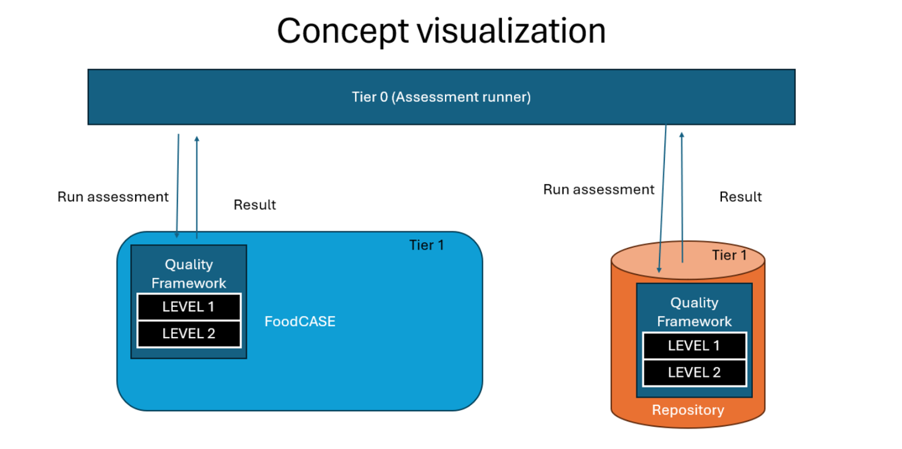
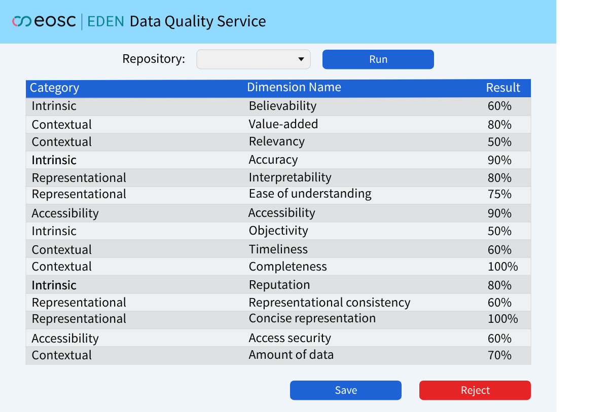
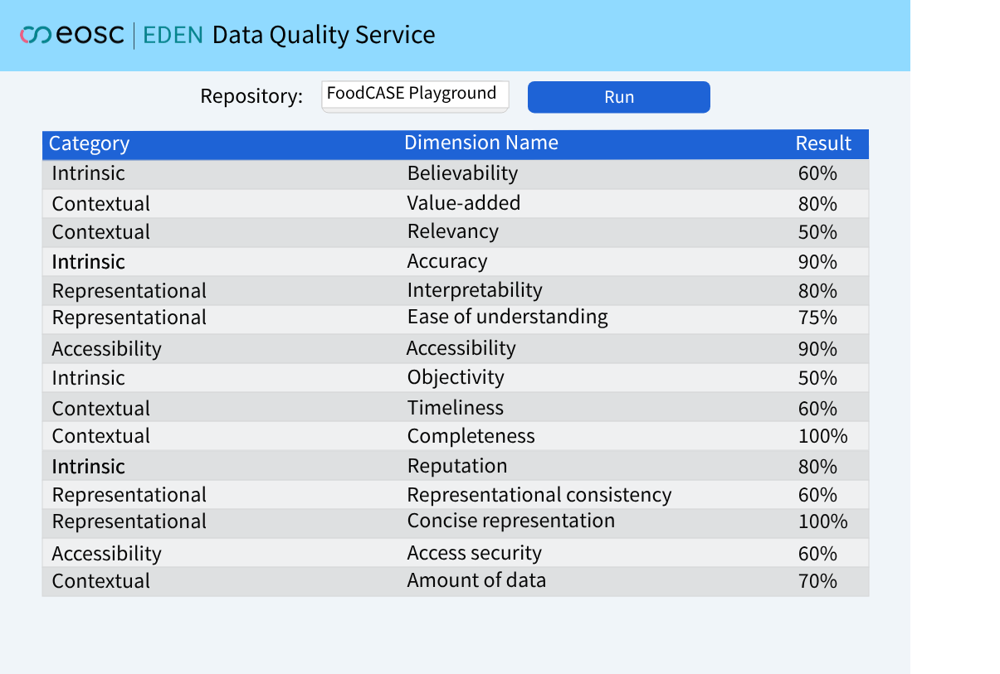
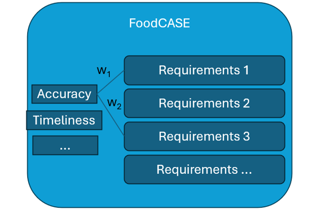

# EDEN Data Quality Service 

## References

1. EOSC Interoperability Framework: Guidelines for semantic and technical interoperability in the European Open Science Cloud.

2. IETF RFC 2119: Key words for use in RFCs to indicate requirement levels.

3. CPP-019 – Data Quality Assessment: link# W3C- Data quality checker Specification

## Abstract
This specification defines the functional and technical requirements for the Data Quality Service (DQS) within the EOSC EDEN ecosystem. The DQS is designed to support the management and assessment of data quality within Trusted Digital Archives (TDAs). 

## Status of This Document
This document is a proposed specification for the EOSC EDEN architecture. This is a draft. 

## Introduction
The Data Quality Service (DQS) is a system responsible for analyzing data according to a predefined set of data quality dimensions. By standardizing dimensions and results, the service enables Trusted Digital Archives (TDAs) to monitor data quality and support decisions about the long-term preservation and reuse of research data. The DQS is organized as a two-tiered system, enabling quality assessment across multiple repositories and domains:

•	Tier 0 – Central Service: An independent service that can trigger data quality assessments in multiple TDAs and collect results in a standardized format, either periodically or on demand.

•	Tier 1 – Data Quality Evaluation: Defines a framework for data quality evaluation across repositories. It combines a set of required quality dimensions selected based on research and established frameworks (e.g., Wang & Strong) with the possibility to include additional, domain-specific extensions. Tier 1 is structured into the following levels:

o	Level 1 – Core Dimensions (Mandatory)
A predefined set of data quality dimensions is established and described through standardized measurement interfaces. These dimensions are required for all TDAs. Each TDA implements the measurements locally, using its own methods, while ensuring that the results remain comparable across repositories.

o	Level 2 – Domain-specific Dimensions (Optional)
Repositories may define additional quality dimensions and corresponding measurement methods based on domain-specific requirements.
These additional dimensions have to follow a common output format to ensure consistency of reported results.

From the perspective of higher-level components (e.g., Tier 0), all reported results are treated as a single set of metrics, without distinguishing between Level 1 and Level 2. 

## Scope

### In Scope:
•	Data quality assessment: Based on the predefined core dimensions and, where applicable, additional domain-specific dimensions

•	Tier 0 – Central Service: Triggering assessments across multiple TDAs and collecting results in a standardized format. Assessments may be run manually or periodically.

•	Dimension measurement interfaces: Ensuring that each TDA implements the required measurement interfaces for Level 1 dimensions. These dimensions are selected based on research and formalized as mandatory measurement elements.

•	Domain-specific quality checks: Allowing repositories to define and measure their own quality requirements, while maintaining a common reporting format 

•	Results reporting: Providing machine-actionable percentage results 

### Out of Scope:
•	Data access and storage: The service responsible for measurement performs all assessments locally within each TDA without direct access to the data content.

•	Data transformation or remediation: The service does not modify, migrate, or transform data. It only assesses quality.

•	Domain standards enforcement: While domain-specific dimensions may be included, the service does not enforce or validate them beyond collecting results in a standardized format.

## UI visualization:
This page appears as the main page. The main purpose is to select a repository to assess from all related repositories using the dropdown list in the center of the page. After selecting a repository, the user can click Run to start the assessment process for the chosen repository.

After clicking Run for the selected repository, a full table with all metrics measured for that repository is displayed.

## Conformance
The keywords MUST, MUST NOT, SHOULD, SHOULD NOT, and MAY are to be interpreted as described in RFC 2119 (https://www.rfc-editor.org/rfc/rfc2119).

## Normative Requirements

### Requirement Group 1 – Data Quality Continuity and Periodicity

●	{{ DQS-REQ-001} The service MUST provide a continuous process for assessing data quality, for example periodic checks such as fixity verification. (Mapped from QUALITY-TECHNICAL-REQ-108)

●	{{ DQS-REQ-002 }}: The TDA MUST support periodic verification of files in the repository. (Mapped from QUALITY-TECHNICAL-REQ-002)

### Requirement Group 2 – User and Domain Interaction

●	{{ DQS-REQ-003 }} DISCIPLINE-SPECIFIC-REQ-040 (Minor – Optional, WP3): Producers and consumers MUST be able to interact with repositories regarding requirements for reappraisal of data quality. (Mapped from DISCIPLINE-SPECIFIC-REQ-040)

### Requirement Group 3 – Quality Dimensions

●	{{ DQS-REQ-004 }} The service MUST support both Level 1 – General and Level 2 – Domain-specific, ensuring compliance with the established measurement interfaces for Level 1 dimensions.

●	{{ DQS-REQ-005}} Level 0, as a central service, MUST trigger assessment processes in associated TDAs and collect results, but MUST NOT perform measurements itself.

●	{{ DQS-REQ-006 }} The service MUST report assessment results in a standardized, machine-actionable format to enable automated processing and further analysis.

## Non-normative Guidance

### Implementation considerations:

Tier 0 – Central Service  
Tier 0 is an independent web service operating above the connected TDAs. The service does not perform measurements itself – it triggers assessment processes in Tier 1 and collects the results. The service knows the addresses of TDA endpoints and stores results in a database for comparison and reporting purposes.

Tier 1 – Data Quality Dimensions:  
Tier 1 provides a unified framework for data quality assessment across repositories. Interfaces and abstract methods are provided for measuring data quality dimensions. Any TDA wishing to participate in the quality assessment system must implement these methods for the measurement dimensions according to its own requirements.

Each method defines only:  
•	the format in which the data will be returned,  
•	which quality dimension is being measured.

### Integration with TDAs:
Tier 0 service can be used to trigger assessments in connected TDAs in a standardized format. All measurements are performed locally within the applications integrated with the TDA, which contain Level 1 and Level 2, according to the provided interfaces and methods.

Assessment results can be used to make decisions on data migration or preservation actions, monitor data quality degradation over time, or to initiate reappraisal for data that no longer meets established quality criteria.

## Integration example:

### Context:
The FoodCASE application has access to data from FoodScience and features its own data quality assessment system based on over 160 requirements. To integrate FoodCASE with the Data Quality Service (Tier 0), it is necessary to perform internal mapping of the application's requirements to the data quality dimensions required by DQS.

FoodCASE acts as a typical Tier 1, where the repository determines how to measure data quality dimensions, while Tier 0 receives the results in a standardized format.

## Integration Process

1. Definition of Data Quality Dimensions in Tier 1 (FoodCASE)

•	These requirements are mapped to standard data quality dimensions, such as accuracy, timeliness, and completeness, based on established publications and research.

•	FoodCASE determines which requirements correspond to individual dimensions and which may be applied to multiple dimensions.

2. Weighting of Dimensions

•	The repository assigns weights to individual requirements within each dimension to reflect their significance in the context of that dimension.

•	The weighting process is entirely performed by the repository – Tier 0 does not intervene in how weights are assigned.

3. Scoring of Dimensions (Score Calculation)

•	Each dimension is scored on a scale from 0 to 100%.

•	Scores are calculated locally in Tier 1 according to the repository's methodology, taking into account both core dimensions (mandatory) and optional domain-specific extensions.

4. Preparation of the Report for Tier 0

•	FoodCASE generates a list of data quality dimensions with the corresponding scores in a standardized format, compliant with Tier 0 requirements.

•	The report contains only the data required by Tier 0 – internal repository details (e.g., which requirements were mapped to which dimensions, internal weights, or additional extensions) are not transmitted.

•	Tier 0 treats all data as a unified, standardized list of dimensions along with their scores.

## References

1. EOSC Interoperability Framework: Guidelines for semantic and technical interoperability in the European Open Science Cloud.

2. IETF RFC 2119: Key words for use in RFCs to indicate requirement levels.

<<<<<<< HEAD
3. CPP-019 – Data Quality Assessment: [link](https://github.com/EOSC-EDEN/wp1-cpp-descriptions/blob/main/CPP-019/EOSC-EDEN_CPP-019_Data_Quality_Assessment.pdf)
=======
3. CPP-019 – Data Quality Assessment: [link](https://github.com/EOSC-EDEN/wp1-cpp-descriptions/blob/main/CPP-019/EOSC-EDEN_CPP-019_Data_Quality_Assessment.pdf)
>>>>>>> 35ea10af2118b481a57571c9a9931aee6597bf68
