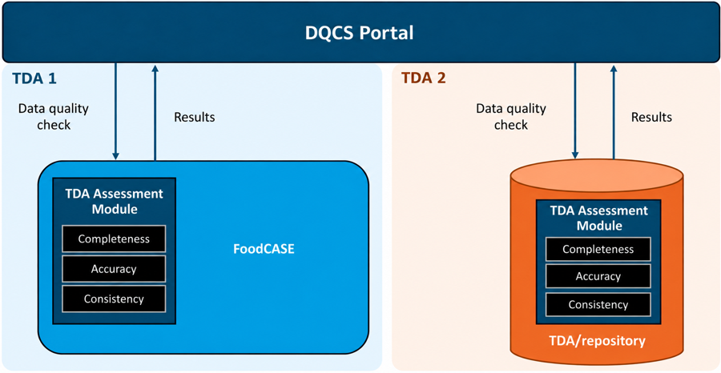

# Data Quality Checker Service (DQCS)

DQCS is an EOSC EDEN service responsible for analysing and performing periodic quality assessments checks, according to a predefined set of data quality indicators (provided by WP1). By standardising indicators and metrics, the service enables Trusted Digital Archives (TDA) or repositories (TDR) to; monitor data quality; support decisions regarding long-term preservation and reuse; and ensure consistency and interoperability of research data over time.

## How it works

- A **TDA Assessment Module** performs quality checks within each TDA and returns indicator scores.
- The **DQCS Portal** retrieves those results and presents them in a consistent format.
- Each indicator has an agreed identifier and a score, TDAs may also provide additional assessment metadata or metadata per each indicator.

## Documentation

- [DQCS Specification](docs/specification.md)
- [Contributing guidelines](CONTRIBUTING.md)
- [License](LICENSE)